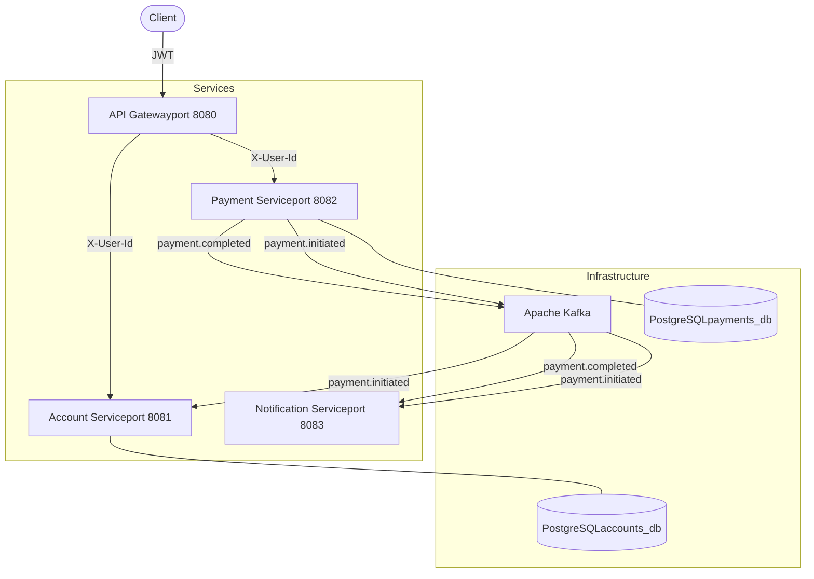

# Payment Transfer API


A production-ready payment and transfer microservices system built with Spring Boot, Apache Kafka, and PostgreSQL. Designed following clean architecture principles and financial industry standards.

## Tech Stack

- **Java 17** + **Spring Boot 3.2**
- **Apache Kafka** — async event-driven communication
- **PostgreSQL** — transactional data storage
- **Docker & Docker Compose** — containerized infrastructure
- **JUnit 5 & Mockito** — unit testing
- **GitHub Actions** — CI/CD pipeline

## Architecture Diagram


## Architecture

This system follows a microservices architecture with three independent services:

| Service | Responsibility | Port |
|---|---|---|
| `api-gateway` | JWT authentication, request routing | 8080 |
| `payment-service` | Payment processing, idempotency, Kafka events | 8082 |
| `notification-service` | Event consumption, notifications | 8083 |

## Getting Started

### Prerequisites
- Java 17
- Docker Desktop

### Run locally

1. Clone the repository
```bash
   git clone https://github.com/PaulGallegos/payment-transfer-api.git
   cd payment-transfer-api/payment-service
```

2. Start infrastructure
```bash
   docker compose up -d
```

3. Run the service
```bash
   ./mvnw spring-boot:run
```

The service will be available at `http://localhost:8082`

## API Endpoints

All requests require the header `X-User-Id: <uuid>`

| Method | Endpoint | Description |
|---|---|---|
| `POST` | `/api/v1/payments` | Create a new payment |
| `GET` | `/api/v1/payments/{id}` | Get payment by ID |
| `GET` | `/api/v1/payments/history` | Get payment history (paginated) |

### Create payment example
```bash
curl -X POST http://localhost:8082/api/v1/payments \
  -H "Content-Type: application/json" \
  -H "X-User-Id: 550e8400-e29b-41d4-a716-446655440000" \
  -d '{
    "receiverAccountId": "660e8400-e29b-41d4-a716-446655440000",
    "amount": 1000.00,
    "currency": "JPY",
    "description": "Transfer to savings",
    "idempotencyKey": "unique-key-001"
  }'
```